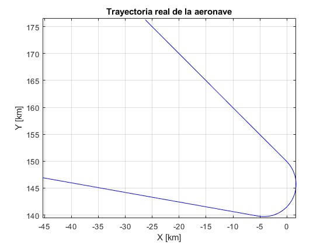
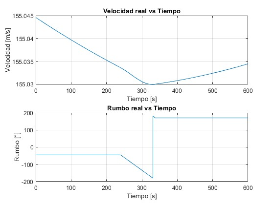
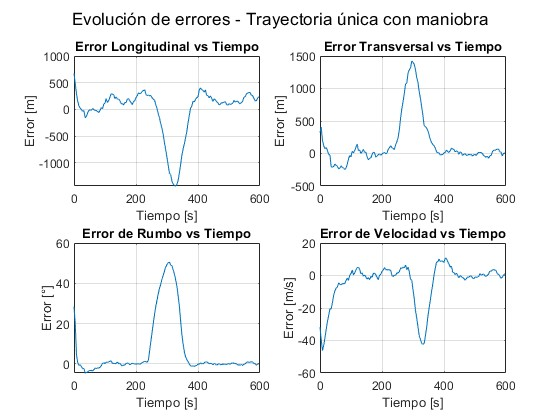
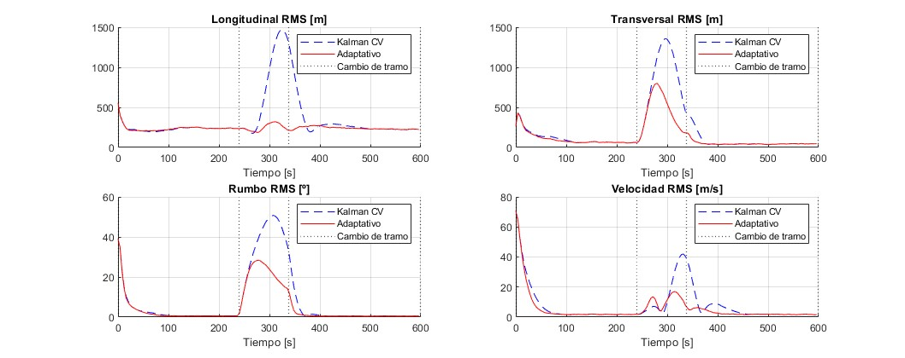

# TFG

## Estructura de archivos

| Archivo | Descripción |
|:--------|:------------|
| `generarTrayectoria.m` | Genera una trayectoria sintética de avión, radar y proyección estereográfica. |
| `ideal_measurement.m` | Calcula las medidas ideales (sin errores) que recibiría el radar. |
| `real_measurement.m` | Introduce errores aleatorios y sistemáticos realistas en las medidas. |
| `kalman_tracker.m` | Aplica el filtro de Kalman de velocidad constante. `q` es parámetro de entrada. (sigma_a) |
| `kalman_tracker_maniobra.m` | Variante con detección de maniobras: adapta la matriz Q si detecta cambios bruscos. |
| `trayectMia.m` | Genera la trayectoria segmentada a partir de aceleraciones longitudinales, transversales y verticales. |
| `elevation2.m` | Calcula la elevación radar hacia la aeronave. |
| `radar2geodetic.m` | Convierte coordenadas radar a geodésicas (latitud, longitud, altura). |
| `montecarlo_prueba.m` | Ejecuta simulaciones Monte Carlo y calcula errores estadísticos. |
| `montecarlo_por_tramos.m` | Evalúa el error de seguimiento por tramos del vuelo (recto, giro, acelerado).|
---
## Que llevo:
- Generación de trayectorias sintéticas con giros.

- Medidas ideales y reales del radar.

- Implementación del filtro de Kalman CV.

- Implementación del filtro con detección de maniobra.

- Evaluación Monte Carlo.

- Análisis de errores RMS por tramo y globales.

- Gráficas comparativas.

- Tabla Markdown y formateo de resultados.
---

## Resultados
### trayectoria 1
- trayectoria:

- en el tiempo:

- sigma_a=0.1: errores:

### montecarlo_prueba
- Monte Carlo ejecutado con 100 simulaciones.
- q= 0.1
- kalman velocidad constante

### montecarlo_por_tramos
- 100 simulaciones
- q=1
- ambos kalman con cv y con detección de maniobra

#### Errores RMS por Tramo

| Tramo | Tipo        | Métrica       | Kalman CV | Kalman con Maniobras | Mejora Relativa |
|-------|-------------|----------------|-----------|------------------------|------------------|
| 1     | Rectilíneo  | Longitudinal   | 1960.32 m | 1957.72 m              | 0.1 %            |
|       |             | Transversal    | 1064.74 m | 1010.44 m              | 5.1 %            |
|       |             | Rumbo          | 63.15 º   | 62.92 º                | 0.4 %            |
|       |             | Velocidad      | 138.78 m/s| 130.58 m/s             | 5.9 %            |
| 2     | **Giro**    | Longitudinal   | 4446.72 m | 1285.50 m              | **71.1 %**       |
|       |             | Transversal    | 4604.95 m | 2463.91 m              | **46.5 %**       |
|       |             | Rumbo          | 193.21 º  | 106.85 º               | **44.7 %**       |
|       |             | Velocidad      | 103.68 m/s| 52.95 m/s              | **48.9 %**       |
| 3     | Rectilíneo  | Longitudinal   | 3049.87 m | 2012.43 m              | 34.0 %           |
|       |             | Transversal    | 910.19 m  | 439.51 m               | 51.7 %           |
|       |             | Rumbo          | 42.72 º   | 14.43 º                | 66.2 %           |
|       |             | Velocidad      | 70.69 m/s | 23.07 m/s              | 67.4 %           |

---
 ## COSAS QUE FALTAN
- número de simulaciones
- comparar con eurocontrol
- la otra trayectoria con aceleración