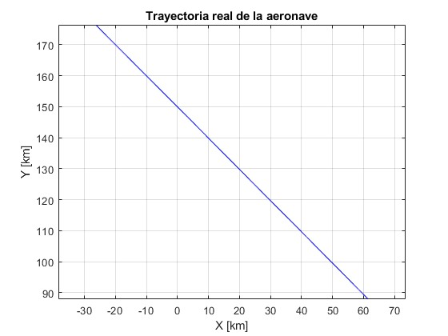
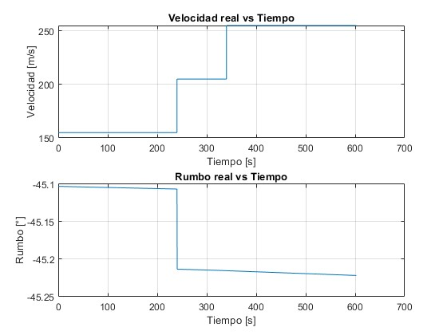
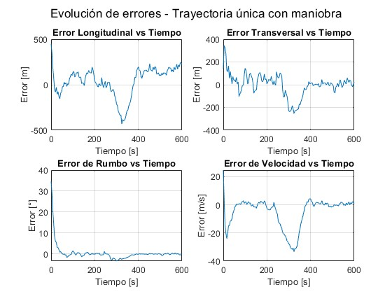
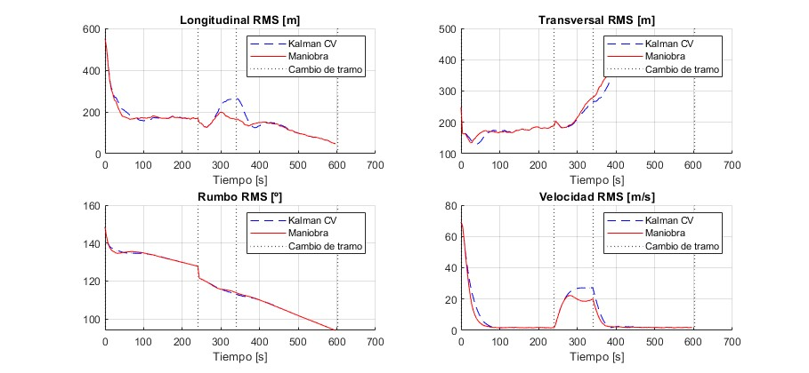

# TFG

## Estructura de archivos

| Archivo | Descripción |
|:--------|:------------|
| `generarTrayectoria.m` | Genera una trayectoria sintética de avión, radar y proyección estereográfica. |
| `ideal_measurement.m` | Calcula las medidas ideales (sin errores) que recibiría el radar. |
| `real_measurement.m` | Introduce errores aleatorios y sistemáticos realistas en las medidas. |
| `kalman_tracker.m` | Aplica el filtro de Kalman de velocidad constante. `q` es parámetro de entrada. (sigma_a) |
| `kalman_tracker_maniobra.m` | Variante con detección de maniobras: adapta la matriz Q si detecta cambios bruscos. |
| `trayectMia.m` | Genera la trayectoria segmentada a partir de aceleraciones longitudinales, transversales y verticales. |
| `elevation2.m` | Calcula la elevación radar hacia la aeronave. |
| `radar2geodetic.m` | Convierte coordenadas radar a geodésicas (latitud, longitud, altura). |
| `montecarlo_prueba.m` | Ejecuta simulaciones Monte Carlo y calcula errores estadísticos. |
| `montecarlo_por_tramos.m` | Evalúa el error de seguimiento por tramos del vuelo (recto, giro, acelerado).|
---
## Que llevo:
- Generación de trayectorias sintéticas con giros.

- Medidas ideales y reales del radar.

- Implementación del filtro de Kalman CV.

- Implementación del filtro con detección de maniobra.

- Evaluación Monte Carlo.

- Análisis de errores RMS por tramo y globales.

- Gráficas comparativas.

- Con ambas trayectorias: sin aceleración y con aceleración.

---

## Resultados
### trayectoria 1
- trayectoria: 

     

- en el tiempo: 

     

- sigma_a=0.1: errores: 

     

### montecarlo_por_tramos
- Nsim = 200 (error relativo un 10%)
- q=0.1
- ambos kalman con cv y con detección de maniobra

     

#### Errores RMS por Tramo-Trayectoria sin aceleración con giro

| Tramo | Tipo        | Duración [s]  | Métrica       | Kalman CV  | Kalman Maniobra  | Mejora Relativa |
|-------|-------------|---------------|----------------|-----------|------------------|------------------|
| 1     | Rectilíneo  | 240.0         | Longitudinal   | 123.96 m  | 122.29 m         | 1.3 %            |
|       |             |               | Transversal    | 101.47 m  | 102.95 m         | –1.5 %           |
|       |             |               | Rumbo          | 73.17 º   | 73.15 º          | 0.0 %            |
|       |             |               | Velocidad      | 10.31 m/s | 9.74 m/s         | 5.5 %            |
| 2     | Giro        | 98.0          | Longitudinal   | 308.26 m  | 143.08 m         | 53.6 %           |
|       |             |               | Transversal    | 327.28 m  | 134.66 m         | 58.9 %           |
|       |             |               | Rumbo          | 39.75 º   | 36.57 º          | 8.0 %            |
|       |             |               | Velocidad      | 7.43 m/s  | 3.80 m/s         | 48.8 %           |
| 3     | Rectilíneo  | 262.0         | Longitudinal   | 155.31 m  | 130.93 m         | 15.7 %           |
|       |             |               | Transversal    | 161.56 m  | 75.42 m          | 53.3 %           |
|       |             |               | Rumbo          | 16.75 º   | 17.23 º          | –2.8 %           |
|       |             |               | Velocidad      | 4.94 m/s  | 1.62 m/s         | 67.3 %           |

---
### trayectoria 2:CON ACELERACIÓN

- trayectoria:

     

- en el tiempo:

     

- sigma_a=0.1: errores:

     

### montecarlo_por_tramos_acel

- Nsim = 200 (error relativo un 10%)
- q=0.1
- ambos kalman con cv y con detección de maniobra

     

### Errores RMS por Tramo – Trayectoria con Aceleración sin giro

| Tramo | Tipo        | Duración [s]  | Métrica        | Kalman CV | Kalman Maniobra  | Mejora Relativa |
|-------|-------------|---------------|----------------|-----------|------------------|------------------|
| 1     | Rectilíneo  | 240.0         | Longitudinal   | 124.91 m  | 120.42 m         | 3.6 %            |
|       |             |               | Transversal    | 91.30 m   | 91.28 m          | 0.0 %            |
|       |             |               | Rumbo          | 73.11 º   | 73.11 º          | 0.0 %            |
|       |             |               | Velocidad      | 9.85 m/s  | 9.38 m/s         | 4.7 %            |
| 2     | Acelerado   | 100.0         | Longitudinal   | 51.86 m   | 52.56 m          | –1.4 %           |
|       |             |               | Transversal    | 82.41 m   | 83.43 m          | –1.2 %           |
|       |             |               | Rumbo          | 41.68 º   | 41.69 º          | 0.0 %            |
|       |             |               | Velocidad      | 4.61 m/s  | 4.49 m/s         | 2.6 %            |
| 3     | Rectilíneo  | 262.0         | Longitudinal   | 70.91 m   | 71.19 m          | –0.4 %           |
|       |             |               | Transversal    | 226.15 m  | 226.30 m         | –0.1 %           |
|       |             |               | Rumbo          | 59.58 º   | 59.59 º          | 0.0 %            |
|       |             |               | Velocidad      | 2.73 m/s  | 2.78 m/s         | –1.7 %           |

 ## COMPARACIÓN CON EUROCONTROL:

### CON Q=0.1 ->

- GIRO:

| Tramo | Tipo        | Duración [s]  | Métrica        | Kalman CV | Maniobra | Umbral EUROCONTROL  | ¿CV Cumple? | ¿Maniobra Cumple?  |
|-------|-------------|---------------|----------------|-----------|----------|---------------------|-------------|--------------------|
| 1     | Rectilíneo  | 240.0         | Longitudinal   | 123.96 m  | 122.29 m | 60.0 m              | No          | No                 |
|       |             |               | Transversal    | 101.47 m  | 102.95 m | 60.0 m              | No          | No                 |
|       |             |               | Rumbo          | 73.17 º   | 73.15 º  | 0.7 º               | No          | No                 |
|       |             |               | Velocidad      | 10.31 m/s | 9.74 m/s | 0.6 m/s             | No          | No                 |
| 2     | Giro        | 98.0          | Longitudinal   | 308.26 m  | 143.08 m | 140.0 m             | No          | No                 |
|       |             |               | Transversal    | 327.28 m  | 134.66 m | 230.0 m             | No          | **Sí**             |
|       |             |               | Rumbo          | 39.75 º   | 36.57 º  | 17.0 º              | No          | No                 |
|       |             |               | Velocidad      | 7.43 m/s  | 3.80 m/s | 6.0 m/s             | No          | **Sí**             |
| 3     | Rectilíneo  | 262.0         | Longitudinal   | 155.31 m  | 130.93 m | 110.0 m             | No          | No                 |
|       |             |               | Transversal    | 161.56 m  | 75.42 m  | 180.0 m             | **Sí**      | **Sí**             |
|       |             |               | Rumbo          | 16.75 º   | 17.23 º  | 9.0 º               | No          | No                 |
|       |             |               | Velocidad      | 4.94 m/s  | 1.62 m/s | 5.0 m/s             | **Sí**      | **Sí**             |

- ACELERACIÓN: 

| Tramo | Tipo        | Duración [s]  | Métrica        | Kalman CV | Maniobra | Umbral EUROCONTROL  | ¿CV Cumple? | ¿Maniobra Cumple?  |
|-------|-------------|---------------|----------------|-----------|----------|---------------------|-------------|--------------------|
| 1     | Rectilíneo  | 240.0         | Longitudinal   | 124.91 m  | 120.42 m | 60.0 m              | No          | No                 |
|       |             |               | Transversal    | 91.30 m   | 91.28 m  | 60.0 m              | No          | No                 |
|       |             |               | Rumbo          | 73.11 º   | 73.11 º  | 0.7 º               | No          | No                 |
|       |             |               | Velocidad      | 9.85 m/s  | 9.38 m/s | 0.6 m/s             | No          | No                 |
| 2     | Acelerado   | 100.0         | Longitudinal   | 51.86 m   | 52.56 m  | 310.0 m             | **Sí**      | **Sí**             |
|       |             |               | Transversal    | 82.41 m   | 83.43 m  | 120.0 m             | **Sí**      | **Sí**             |
|       |             |               | Rumbo          | 41.68 º   | 41.69 º  | 2.5 º               | No          | No                 |
|       |             |               | Velocidad      | 4.61 m/s  | 4.49 m/s | 26.0 m/s            | **Sí**      | **Sí**             |
| 3     | Rectilíneo  | 262.0         | Longitudinal   | 70.91 m   | 71.19 m  | 180.0 m             | **Sí**      | **Sí**             |
|       |             |               | Transversal    | 226.15 m  | 226.30 m | 60.0 m              | No          | No                 |
|       |             |               | Rumbo          | 59.58 º   | 59.59 º  | 1.5 º               | No          | No                 |
|       |             |               | Velocidad      | 2.73 m/s  | 2.78 m/s | 17.0 m/s            | **Sí**      | **Sí**             |

### CON Q= 1

- GIRO:

| Tramo | Tipo        | Duración [s] | Métrica       | Kalman CV | Maniobra | Umbral EUROCONTROL | ¿CV Cumple? | ¿Maniobra Cumple? |
|-------|-------------|---------------|----------------|-----------|----------|---------------------|-------------|--------------------|
| 1     | Rectilíneo  | 240.0         | Longitudinal   | 126.80 m  | 122.74 m | 60.0 m              | No          | No                 |
|       |             |               | Transversal    | 96.07 m   | 96.26 m  | 60.0 m              | No          | No                 |
|       |             |               | Rumbo          | 73.31 º   | 73.27 º  | 0.7 º               | No          | No                 |
|       |             |               | Velocidad      | 9.43 m/s  | 9.02 m/s | 0.6 m/s             | No          | No                 |
| 2     | Giro        | 98.0          | Longitudinal   | 119.90 m  | 85.84 m  | 140.0 m             | **Sí**      | **Sí**             |
|       |             |               | Transversal    | 117.75 m  | 86.02 m  | 230.0 m             | **Sí**      | **Sí**             |
|       |             |               | Rumbo          | 37.01 º   | 36.66 º  | 17.0 º              | No          | No                 |
|       |             |               | Velocidad      | 4.12 m/s  | 3.56 m/s | 6.0 m/s             | **Sí**      | **Sí**             |
| 3     | Rectilíneo  | 262.0         | Longitudinal   | 127.03 m  | 127.69 m | 110.0 m             | No          | No                 |
|       |             |               | Transversal    | 72.69 m   | 71.74 m  | 180.0 m             | **Sí**      | **Sí**             |
|       |             |               | Rumbo          | 17.28 º   | 17.36 º  | 9.0 º               | No          | No                 |
|       |             |               | Velocidad      | 2.63 m/s  | 2.75 m/s | 5.0 m/s             | **Sí**      | **Sí**             |

- ACELERACIÓN: 

| Tramo | Tipo        | Duración [s]  | Métrica        | Kalman CV | Maniobra | Umbral EUROCONTROL  | ¿CV Cumple? | ¿Maniobra Cumple? |
|-------|-------------|---------------|----------------|-----------|----------|---------------------|-------------|--------------------|
| 1     | Rectilíneo  | 240.0         | Longitudinal   | 130.16 m  | 126.89 m | 60.0 m              | No          | No                 |
|       |             |               | Transversal    | 101.18 m  | 101.47 m | 60.0 m              | No          | No                 |
|       |             |               | Rumbo          | 73.28 º   | 73.25 º  | 0.7 º               | No          | No                 |
|       |             |               | Velocidad      | 9.63 m/s  | 9.20 m/s | 0.6 m/s             | No          | No                 |
| 2     | Acelerado   | 100.0         | Longitudinal   | 54.49 m   | 55.27 m  | 310.0 m             | **Sí**      | **Sí**             |
|       |             |               | Transversal    | 94.09 m   | 95.05 m  | 120.0 m             | **Sí**      | **Sí**             |
|       |             |               | Rumbo          | 41.68 º   | 41.69 º  | 2.5 º               | No          | No                 |
|       |             |               | Velocidad      | 4.56 m/s  | 4.43 m/s | 26.0 m/s            | **Sí**      | **Sí**             |
| 3     | Rectilíneo  | 262.0         | Longitudinal   | 77.18 m   | 77.52 m  | 180.0 m             | **Sí**      | **Sí**             |
|       |             |               | Transversal    | 253.20 m  | 253.42 m | 60.0 m              | No          | No                 |
|       |             |               | Rumbo          | 59.58 º   | 59.58 º  | 1.5 º               | No          | No                 |
|       |             |               | Velocidad      | 2.67 m/s  | 2.72 m/s | 17.0 m/s            | **Sí**      | **Sí**             |

### con q=10:

- GIRO:

| Tramo | Tipo        | Duración [s] | Métrica       | Kalman CV | Maniobra | Umbral EUROCONTROL | ¿CV Cumple? | ¿Maniobra Cumple? |
|-------|-------------|---------------|----------------|-----------|----------|---------------------|-------------|--------------------|
| 1     | Rectilíneo  | 240.0         | Longitudinal   | 133.95 m  | 129.01 m | 60.0 m              | No          | No                 |
|       |             |               | Transversal    | 102.34 m  | 102.07 m | 60.0 m              | No          | No                 |
|       |             |               | Rumbo          | 73.28 º   | 73.14 º  | 0.7 º               | No          | No                 |
|       |             |               | Velocidad      | 9.68 m/s  | 10.76 m/s| 0.6 m/s             | No          | No                 |
| 2     | Giro        | 98.0          | Longitudinal   | 73.68 m   | 73.67 m  | 140.0 m             | **Sí**      | **Sí**             |
|       |             |               | Transversal    | 75.10 m   | 75.44 m  | 230.0 m             | **Sí**      | **Sí**             |
|       |             |               | Rumbo          | 36.83 º   | 36.88 º  | 17.0 º              | No          | No                 |
|       |             |               | Velocidad      | 3.70 m/s  | 4.09 m/s | 6.0 m/s             | **Sí**      | **Sí**             |
| 3     | Rectilíneo  | 262.0         | Longitudinal   | 138.45 m  | 138.54 m | 110.0 m             | No          | No                 |
|       |             |               | Transversal    | 78.55 m   | 78.62 m  | 180.0 m             | **Sí**      | **Sí**             |
|       |             |               | Rumbo          | 17.51 º   | 17.53 º  | 9.0 º               | No          | No                 |
|       |             |               | Velocidad      | 5.89 m/s  | 6.09 m/s | 5.0 m/s             | No          | No                 |

- ACELERACIÓN: 

| Tramo | Tipo        | Duración [s] | Métrica       | Kalman CV | Maniobra | Umbral EUROCONTROL | ¿CV Cumple? | ¿Maniobra Cumple? |
|-------|-------------|---------------|----------------|-----------|----------|---------------------|-------------|--------------------|
| 1     | Rectilíneo  | 240.0         | Longitudinal   | 133.56 m  | 128.30 m | 60.0 m              | No          | No                 |
|       |             |               | Transversal    | 101.89 m  | 101.78 m | 60.0 m              | No          | No                 |
|       |             |               | Rumbo          | 73.39 º   | 73.24 º  | 0.7 º               | No          | No                 |
|       |             |               | Velocidad      | 9.35 m/s  | 10.44 m/s| 0.6 m/s             | No          | No                 |
| 2     | Acelerado   | 100.0         | Longitudinal   | 66.35 m   | 66.40 m  | 310.0 m             | **Sí**      | **Sí**             |
|       |             |               | Transversal    | 102.82 m  | 102.84 m | 120.0 m             | **Sí**      | **Sí**             |
|       |             |               | Rumbo          | 41.81 º   | 41.81 º  | 2.5 º               | No          | No                 |
|       |             |               | Velocidad      | 3.86 m/s  | 3.92 m/s | 26.0 m/s            | **Sí**      | **Sí**             |
| 3     | Rectilíneo  | 262.0         | Longitudinal   | 82.44 m   | 82.49 m  | 180.0 m             | **Sí**      | **Sí**             |
|       |             |               | Transversal    | 252.50 m  | 252.50 m | 60.0 m              | No          | No                 |
|       |             |               | Rumbo          | 59.61 º   | 59.61 º  | 1.5 º               | No          | No                 |
|       |             |               | Velocidad      | 5.51 m/s  | 5.64 m/s | 17.0 m/s            | **Sí**      | **Sí**             |

### con q=5:

- GIRO:

| Tramo | Tipo        | Duración [s] | Métrica       | Kalman CV | Maniobra | Umbral EUROCONTROL | ¿CV Cumple? | ¿Maniobra Cumple? |
|-------|-------------|---------------|----------------|-----------|----------|---------------------|-------------|--------------------|
| 1     | Rectilíneo  | 240.0         | Longitudinal   | 132.87 m  | 127.57 m | 60.0 m              | No          | No                 |
|       |             |               | Transversal    | 100.44 m  | 100.51 m | 60.0 m              | No          | No                 |
|       |             |               | Rumbo          | 73.36 º   | 73.33 º  | 0.7 º               | No          | No                 |
|       |             |               | Velocidad      | 9.15 m/s  | 9.73 m/s | 0.6 m/s             | No          | No                 |
| 2     | Giro        | 98.0          | Longitudinal   | 77.27 m   | 75.40 m  | 140.0 m             | **Sí**      | **Sí**             |
|       |             |               | Transversal    | 77.87 m   | 76.73 m  | 230.0 m             | **Sí**      | **Sí**             |
|       |             |               | Rumbo          | 36.80 º   | 36.77 º  | 17.0 º              | No          | No                 |
|       |             |               | Velocidad      | 3.47 m/s  | 3.91 m/s | 6.0 m/s             | **Sí**      | **Sí**             |
| 3     | Rectilíneo  | 262.0         | Longitudinal   | 134.70 m  | 134.87 m | 110.0 m             | No          | No                 |
|       |             |               | Transversal    | 75.19 m   | 75.43 m  | 180.0 m             | **Sí**      | **Sí**             |
|       |             |               | Rumbo          | 17.45 º   | 17.48 º  | 9.0 º               | No          | No                 |
|       |             |               | Velocidad      | 4.46 m/s  | 4.63 m/s | 5.0 m/s             | **Sí**      | **Sí**             |

- ACELERACIÓN:

| Tramo | Tipo        | Duración [s] | Métrica       | Kalman CV | Maniobra | Umbral EUROCONTROL | ¿CV Cumple? | ¿Maniobra Cumple? |
|-------|-------------|---------------|----------------|-----------|----------|---------------------|-------------|--------------------|
| 1     | Rectilíneo  | 240.0         | Longitudinal   | 131.78 m  | 127.14 m | 60.0 m              | No          | No                 |
|       |             |               | Transversal    | 101.56 m  | 101.33 m | 60.0 m              | No          | No                 |
|       |             |               | Rumbo          | 73.15 º   | 73.18 º  | 0.7 º               | No          | No                 |
|       |             |               | Velocidad      | 9.70 m/s  | 10.21 m/s| 0.6 m/s             | No          | No                 |
| 2     | Acelerado   | 100.0         | Longitudinal   | 63.01 m   | 63.27 m  | 310.0 m             | **Sí**      | **Sí**             |
|       |             |               | Transversal    | 100.39 m  | 100.55 m | 120.0 m             | **Sí**      | **Sí**             |
|       |             |               | Rumbo          | 41.78 º   | 41.78 º  | 2.5 º               | No          | No                 |
|       |             |               | Velocidad      | 3.70 m/s  | 3.76 m/s | 26.0 m/s            | **Sí**      | **Sí**             |
| 3     | Rectilíneo  | 262.0         | Longitudinal   | 80.21 m   | 80.30 m  | 180.0 m             | **Sí**      | **Sí**             |
|       |             |               | Transversal    | 250.05 m  | 250.09 m | 60.0 m              | No          | No                 |
|       |             |               | Rumbo          | 59.60 º   | 59.60 º  | 1.5 º               | No          | No                 |
|       |             |               | Velocidad      | 4.31 m/s  | 4.44 m/s | 17.0 m/s            | **Sí**      | **Sí**             |

### CON Q= 2.5:

- GIRO:

| Tramo | Tipo        | Duración [s] | Métrica       | Kalman CV | Maniobra | Umbral EUROCONTROL | ¿CV Cumple? | ¿Maniobra Cumple? |
|-------|-------------|---------------|----------------|-----------|----------|---------------------|-------------|--------------------|
| 1     | Rectilíneo  | 240.0         | Longitudinal   | 129.57 m  | 126.06 m | 60.0 m              | No          | No                 |
|       |             |               | Transversal    | 99.16 m   | 99.19 m  | 60.0 m              | No          | No                 |
|       |             |               | Rumbo          | 73.37 º   | 73.34 º  | 0.7 º               | No          | No                 |
|       |             |               | Velocidad      | 9.16 m/s  | 9.20 m/s | 0.6 m/s             | No          | No                 |
| 2     | Giro        | 98.0          | Longitudinal   | 90.14 m   | 80.74 m  | 140.0 m             | **Sí**      | **Sí**             |
|       |             |               | Transversal    | 87.63 m   | 79.97 m  | 230.0 m             | **Sí**      | **Sí**             |
|       |             |               | Rumbo          | 36.79 º   | 36.70 º  | 17.0 º              | No          | No                 |
|       |             |               | Velocidad      | 3.47 m/s  | 3.60 m/s | 6.0 m/s             | **Sí**      | **Sí**             |
| 3     | Rectilíneo  | 262.0         | Longitudinal   | 132.95 m  | 133.34 m | 110.0 m             | No          | No                 |
|       |             |               | Transversal    | 74.02 m   | 74.41 m  | 180.0 m             | **Sí**      | **Sí**             |
|       |             |               | Rumbo          | 17.38 º   | 17.43 º  | 9.0 º               | No          | No                 |
|       |             |               | Velocidad      | 3.55 m/s  | 3.72 m/s | 5.0 m/s             | **Sí**      | **Sí**             |

- ACELERACIÓN:

| Tramo | Tipo        | Duración [s] | Métrica       | Kalman CV | Maniobra | Umbral EUROCONTROL | ¿CV Cumple? | ¿Maniobra Cumple? |
|-------|-------------|---------------|----------------|-----------|----------|---------------------|-------------|--------------------|
| 1     | Rectilíneo  | 240.0         | Longitudinal   | 126.09 m  | 122.73 m | 60.0 m              | No          | No                 |
|       |             |               | Transversal    | 97.97 m   | 98.00 m  | 60.0 m              | No          | No                 |
|       |             |               | Rumbo          | 73.33 º   | 73.32 º  | 0.7 º               | No          | No                 |
|       |             |               | Velocidad      | 9.28 m/s  | 9.37 m/s | 0.6 m/s             | No          | No                 |
| 2     | Acelerado   | 100.0         | Longitudinal   | 58.14 m   | 58.64 m  | 310.0 m             | **Sí**      | **Sí**             |
|       |             |               | Transversal    | 94.25 m   | 94.55 m  | 120.0 m             | **Sí**      | **Sí**             |
|       |             |               | Rumbo          | 41.73 º   | 41.73 º  | 2.5 º               | No          | No                 |
|       |             |               | Velocidad      | 3.90 m/s  | 3.92 m/s | 26.0 m/s            | **Sí**      | **Sí**             |
| 3     | Rectilíneo  | 262.0         | Longitudinal   | 76.57 m   | 76.71 m  | 180.0 m             | **Sí**      | **Sí**             |
|       |             |               | Transversal    | 242.92 m  | 242.98 m | 60.0 m              | No          | No                 |
|       |             |               | Rumbo          | 59.60 º   | 59.60 º  | 1.5 º               | No          | No                 |
|       |             |               | Velocidad      | 3.39 m/s  | 3.50 m/s | 17.0 m/s            | **Sí**      | **Sí**             |

#### OBSERVACIONES ENTRE Q's:

| q      | Trayectoria      | Filtro              | Métricas que cumplen (de 12) |
|--------|------------------|---------------------|-------------------------------|
| 0.1    | Giro             | Kalman CV           | 4                             |
|        |                  | Kalman Maniobra     | 5                             |
|        | Aceleración      | Kalman CV           | 5                             |
|        |                  | Kalman Maniobra     | 5                             |
| 1      | Giro             | Kalman CV           | 4                             |
|        |                  | Kalman Maniobra     | 6                             |
|        | Aceleración      | Kalman CV           | 5                             |
|        |                  | Kalman Maniobra     | 5                             |
| 2.5    | Giro             | Kalman CV           | 6                             |
|        |                  | Kalman Maniobra     | 6                             |
|        | Aceleración      | Kalman CV           | 5                             |
|        |                  | Kalman Maniobra     | 5                             |
| 5      | Giro             | Kalman CV           | 6                             |
|        |                  | Kalman Maniobra     | 6                             |
|        | Aceleración      | Kalman CV           | 5                             |
|        |                  | Kalman Maniobra     | 5                             |
| 10     | Giro             | Kalman CV           | 5                             |
|        |                  | Kalman Maniobra     | 5                             |
|        | Aceleración      | Kalman CV           | 5                             |
|        |                  | Kalman Maniobra     | 5                             |
