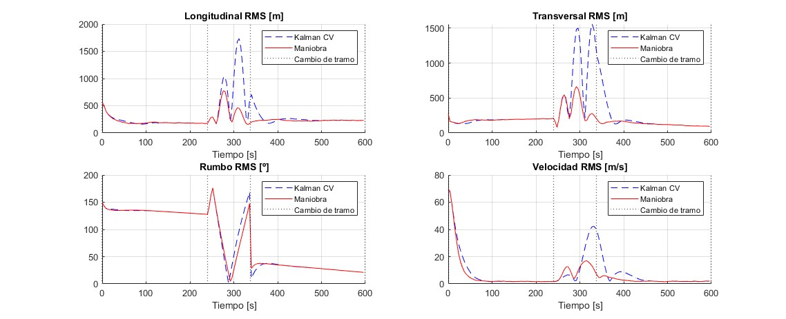

# TFG

## Que llevo:

- Generación de trayectorias: con giro (sin aceleracion) y con aceleración (sin giro).

- Implementación del filtro de Kalman CV.

- Implementación del filtro con detección de maniobra.

- Evaluación Monte Carlo.

- Análisis de errores RMS por tramo y globales.

- Gráficas comparativas.

- Calculo del número de ensayos.

- Comparación con Eurocontrol.

## Que voy a hacer ahora:

- que detecte el movimiento y cambie el filtro

---

## Resultados
### Trayectoria 1: CON GIRO
- trayectoria: 

     

- en el tiempo: 

     

- sigma_a=0.1: errores: 

     

### montecarlo_por_tramos
- Nsim = 200 (error relativo un 10%)
- q=0.1
- ambos kalman con cv y con detección de maniobra

     

#### Errores RMS por Tramo-Trayectoria sin aceleración con giro

---
### Trayectoria 2:CON ACELERACIÓN

- trayectoria:

     

- en el tiempo:

     

- sigma_a=0.1: errores:

     

### montecarlo_por_tramos_acel

- Nsim = 200 (error relativo un 10%)
- q=0.1
- ambos kalman con cv y con detección de maniobra

     

### Errores RMS por Tramo – Trayectoria con Aceleración sin giro

## COMPARACIÓN CON EUROCONTROL:

### PRIMERO GIRO:

**Parámetros utilizados**:  
- `q_value = 2` (filtro CV)  
- `q_maniobra = 5` (modo maniobra)

| Tramo | Tipo        | Duración [s] | Métrica       | Kalman CV        | Maniobra         | Umbral EUROCONTROL |
|-------|-------------|--------------|---------------|------------------|------------------|---------------------|
| 1     | Rectilíneo  | 240.0        | Longitudinal  | 132.88 m | 132.05 m | 60.0 m              |
|       |             |              | Transversal   | 96.42 m  | 96.65 m  | 60.0 m              |
|       |             |              | Rumbo         | 73.31 º  | 73.29 º  | 0.7 º               |
|       |             |              | Velocidad     | 9.21 m/s | 8.86 m/s | 0.6 m/s             |
| 2     | Giro        | 98.0         | Longitudinal  | 93.34 m  | 81.32 m  | 140.0 m             |
|       |             |              | Transversal   | 92.14 m  | 80.65 m  | 230.0 m             |
|       |             |              | Rumbo         | 36.83 º  | 36.66 º  | 17.0 º              |
|       |             |              | Velocidad     | 3.58 m/s | 3.33 m/s | 6.0 m/s             |
| 3     | Rectilíneo  | 262.0        | Longitudinal  | 127.91 m | 128.20 m | 110.0 m             |
|       |             |              | Transversal   | 72.12 m  | 72.35 m  | 180.0 m             |
|       |             |              | Rumbo         | 17.36 º  | 17.42 º  | 9.0 º               |
|       |             |              | Velocidad     | 3.32 m/s | 3.53 m/s | 5.0 m/s             |

#### OBSERVACIONES ENTRE Q's:

